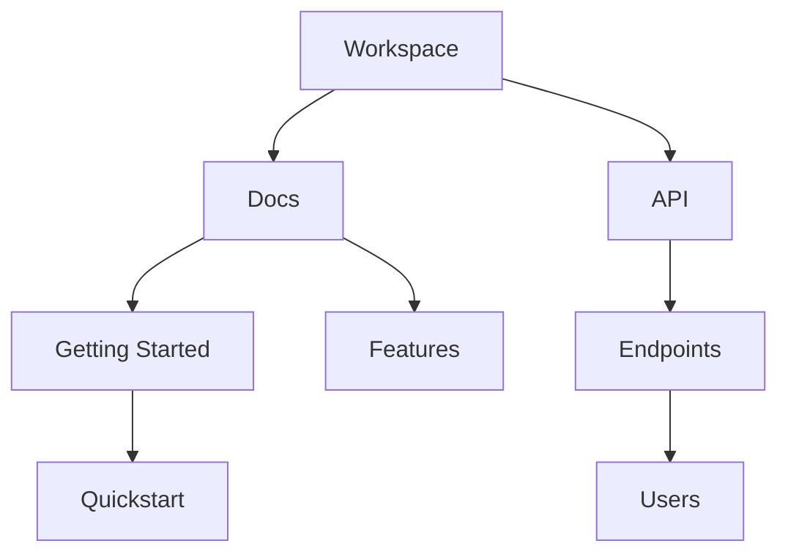

## Overview

Paperguide-pay provides powerful tools to manage your documentation projects. You create, organize, search, version, and collaborate on docs seamlessly. Key capabilities include rich editing interfaces, hierarchical folders, advanced search, version history, and sharing options.

<Columns cols={3}>
  <Card title="Document Creation" icon="edit-3" href="#document-creation">
    Build docs with markdown support and live previews.
  </Card>
  <Card title="Organization" icon="folder" href="#organization">
    Structure content in nested folders.
  </Card>
  <Card title="Search & Filter" icon="search" href="#search">
    Find docs quickly with full-text search.
  </Card>
  <Card title="Version Control" icon="git-branch" href="#version-control">
    Track changes with full history.
  </Card>
  <Card title="Collaboration" icon="users" href="#collaboration">
    Share and co-edit with teams.
  </Card>
</Columns>

## Document Creation and Editing

Create new documents directly in Paperguide-pay. You access the editor from any folder or workspace.

<Steps>
  <Step title="Start a New Doc" icon="plus">
    Click the `<kbd>New Document</kbd>` button in the sidebar.

    Select your workspace or folder.
  </Step>
  <Step title="Edit Content" icon="edit">
    Use the WYSIWYG editor or switch to markdown mode.

````markdown
```markdown
# Welcome to Paperguide-pay

This is your first document. Add headings, lists, and code blocks.
```
````
  </Step>
  <Step title="Preview and Publish" icon="eye">
    Toggle live preview and click `<kbd>Publish</kbd>` to make it live.
  </Step>
</Steps>

<Callout kind="tip">
  Enable real-time collaboration in the editor settings for team editing.
</Callout>

## Folder and Hierarchy Organization

Organize docs into folders and subfolders for better navigation. Create unlimited nesting levels.



Drag and drop to reorder. Use folder permissions to control access.

## Search and Filtering

Locate documents instantly with Paperguide-pay's search bar. Filter by tags, authors, or dates.

<Tabs>
  <Tab title="Full-Text Search" icon="search">
    Type keywords to search across all docs.

    Filters appear automatically: by folder, date range, or status.
  </Tab>
  <Tab title="Advanced Filters" icon="filter">
    Use operators like `tag:api` or `author:john`.

    Combine with `folder:docs` for precise results.
  </Tab>
</Tabs>

## Version Control for Docs

Every change creates a new version. You view, compare, and revert history easily.

<CodeGroup tabs="CLI,API">
  ````bash
  paperguide versions list --doc-id=doc_123
  paperguide versions revert --doc-id=doc_123 --version=v1.2
  ````
  ````javascript
  const response = await fetch('https://api.example.com/docs/doc_123/versions', {
    headers: { Authorization: `Bearer ${YOUR_API_KEY}` }
  });
  const versions = await response.json();
  ````
</CodeGroup>

<Expandable title="Compare Versions" default-open="true">
  Select two versions in the history panel to see diff highlights.
</Expandable>

## Collaboration and Sharing Options

Invite team members and share docs externally. Set granular permissions.

| Feature | Description | Use Case |
|---------|-------------|----------|
| Invite Users | Add by email with roles (editor, viewer) | Team workspaces |
| Public Links | Generate shareable URLs | Client docs |
| Embed Docs | iFrame code for websites | Knowledge bases |
| Webhooks | Notify on changes | CI/CD integration |

<Callout kind="success">
  Start collaborating by inviting your first team member from the workspace settings.
</Callout>